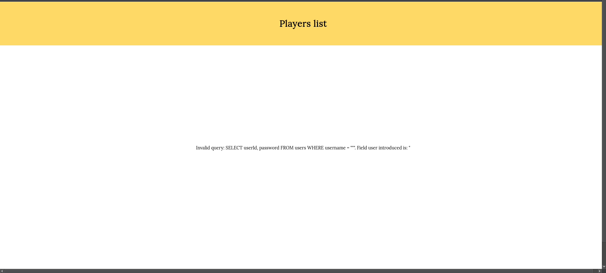
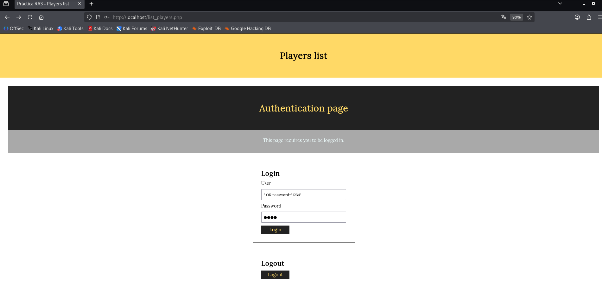
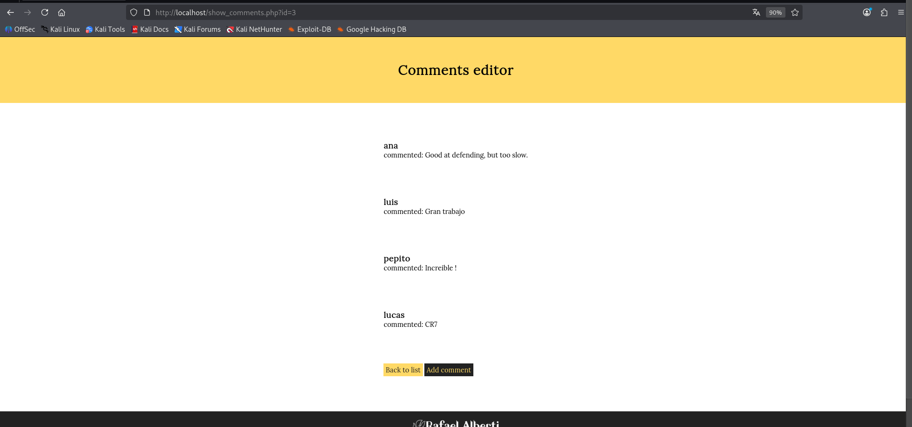
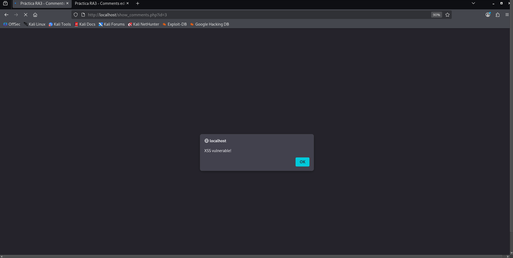

# Proyecto 3

**Nombre:** David Jimenez Ruiz  
**Fecha:** 12 de enero de 2026  

## Parte 1 - SQLi

La página no permite añadir jugadores a usuarios no autenticados, un formulario nos exige que introduzcamos un usuario y contraseña válidos. Lo primero que haremos es comprobar que este formulario es vulnerable a una inyección y aprovecharlo para saltarnos esta protección.

### a) Ejemplo de combinación para provocar error SQL

**Escribo los valores:** usuario: `"` y contraseña: (vacío).  

**En el campo:** En el campo **usuario**.  

**Del formulario de la página:** Del formulario de la página **login**.  

**La consulta SQL que se ejecuta es:** **SELECT UserId,password FROM users WHERE username="'"**.  

**Campos del formulario web utilizados en la consulta SQL:** **usuario**.  

**Campos del formulario web no utilizados en la consulta SQL:** **contraseña**. 



### b) Ataque de diccionario para impersonar usuario

**Explicación del ataque:**  
El ataque consiste en realizar un brute-force de contraseñas del diccionario en el campo usuario mediante SQL Injection, inyectando una condición lógica que verifica si cualquier row tiene password coincidente con la prueba, independientemente del username. Se repite por cada contraseña del diccionario hasta encontrar coincidencia, permitiendo login sin conocer usernames ni número de usuarios.

**Diccionario de contraseñas probadas:**  
- password  
- 123456  
- 12345678  
- 1234 (éxito)  
- qwerty  
- 12345678 (repetida)  
- dragon  

**Ejemplo de payload exitoso:**  
- Usuario: `' OR password="1234" --`  
- Contraseña: `1234`  
Esto modifica la consulta a `SELECT UserId,password FROM users WHERE username='' OR password="1234" --`, haciendo TRUE para el usuario **luis** con esa password y comentando el resto. 

Entonces iremos probando cambiando el password al igual que el campo contraseña a la vez. Ejemplo: `' OR password="123456" --` | Contraseña: `123456`

**Campos del formulario con el ataque:**  
- **Campo de usuario con el ataque:** `' OR password="1234" --`  
- **Campo de contraseña con el ataque:** `1234`  
- **Ha tenido éxito:** Sí, accede como usuario **luis**. 



### c) Error en SQLite3::escapeString() y corrección

**Error de programación:**  
La función `SQLite3::escapeString()` solo escapa comillas simples internas (') en literales de cadena, pero no previene inyecciones porque la concatenación `'SELECT userId, password FROM users WHERE username = "' . $escaped_user . '"'` permite cerrar la cadena externa con una comilla doble (") inyectada (ej: `") OR 1=1 --`), alterando la lógica SQL. Además, usa comillas dobles para delimitar, incompatibles con su escaping de comillas simples, y revela queries en errores exponiendo estructura.  

**Solución recomendada:**  
- **Línea a quitar:** Eliminar la línea 9: `$query = SQLite3::escapeString('SELECT userId, password FROM users WHERE username = "' . $user . '"');`  
- **Código a poner en su lugar (líneas 9-11):**  
```php
$stmt = $db->prepare('SELECT userId, password FROM users WHERE username = :user');
$stmt->bindValue(':user', $user, SQLITE3_TEXT);
$result = $stmt->execute();
```
### d) Vulnerabilidad en add_comment.php~ y explotación

**Vulnerabilidad encontrada:**
SQL Injection en la variable `$_GET['id']` (línea 13), usada directamente sin sanitizar ni escaping en la query INSERT: `"INSERT INTO comments (playerId, userId, body) VALUES ('".$_GET['id']."', '".$_COOKIE['userId']."', '$body')"`. Aunque `body` usa `SQLite3::escapeString()`, `$_GET['id']` permite inyectar código SQL arbitrario. 

**Descripción del ataque:**  
Autenticados como **luis** (password 1234), accedemos a `add_comment.php~?id=1` (o playerId válido). Para publicar como otros usuarios, inyectamos en `?id`: `1') ; INSERT INTO comments (playerId, userId, body) VALUES (1, [OTRO_userId], 'Comentario positivo para Candela Pacheco') ; --`. Esto cierra la query original, inserta un nuevo comentario con `userId` spoofed y comenta el resto, creando múltiples comentarios positivos desde cuentas ajenas.  



**¿Cómo podríamos hacer segura esta entrada?:**  
- Usar **prepared statements** para toda la query:  
```php
$stmt = $db->prepare('INSERT INTO comments (playerId, userId, body) VALUES (:playerId, :userId, :body)');
$stmt->bindValue(':playerId', $_GET['id'], SQLITE3_INTEGER);
$stmt->bindValue(':userId', $_COOKIE['userId'], SQLITE3_INTEGER);
$stmt->bindValue(':body', $body, SQLITE3_TEXT);
$stmt->execute();
```
## Parte 2 - XSS

En vistas de los problemas de seguridad que habéis encontrado, empezáis a sospechar que esta aplicación quizás es vulnerable a XSS (Cross Site Scripting).

### a) Mensaje para generar alert de JavaScript

**Introduzco el mensaje:** `<script>alert('XSS vulnerable!');</script>`  
**En el formulario de la página:** `add_comment.php?id=3`  

Este payload se inserta en `body` del comentario (SQLite3::escapeString escapa solo ', no <>) y, al renderizar en `show_comments.php` sin escapar HTML (innerHTML probable), ejecuta JS mostrando alert al consultar comentarios del jugador 3.  



### b) Explicación de &amp; en enlaces GET

**¿Por qué aparece &amp; en lugar de &?**  
En HTML, el carácter `&` es reservado para entidades (como `&lt;`, `&gt;`). Cuando un enlace con parámetros GET como `http://www.donate.co?amount=100&destination=ACMEScouting/` se inserta en código HTML (`<a href="...">`), el `&` debe codificarse como `&amp;` para que el navegador lo interprete correctamente como separador de parámetros, no como inicio de entidad. 

**Ejemplo del código fuente:**  
```html
<a href="http://www.donate.co?amount=100&amp;destination=ACMEScouting/">donate</a>
```

### c) Problema en show_comments.php y corrección

**¿Cuál es el problema?**  
Reflected y Stored XSS: `$_GET['id']` se inserta sin sanitizar en query SQL (línea ~20: `C.playerId =".$_GET['id']."`), vulnerable a SQLi, y `body` del comentario se imprime directamente con `echo $row['body']` (línea ~28) sin escapar HTML/JS, permitiendo ejecutar scripts inyectados (ej. `<script>alert(1)</script>`). También SQLi en query por concatenación directa.  

**Sustituyo el código por las líneas (lo que está mal):**  
- Línea ~20: `$query = "SELECT commentId, username, body FROM comments C, users U WHERE C.playerId =".$_GET['id']." AND U.userId = C.userId order by C.playerId desc";`  
- Línea ~28: `echo "<div> <h4> ". $row['username'] ."</h4>  <p>commented: " . $row['body'] . "</p> </div>";`  

**Por el siguiente código:**  
```php
// Validar y preparar id
$id = filter_var($_GET['id'] ?? 0, FILTER_VALIDATE_INT);
if (!$id || $id <= 0) {
    die('ID inválido');
}

// Query parametrizada
$stmt = $db->prepare('SELECT commentId, username, body FROM comments C, users U WHERE C.playerId = :id AND U.userId = C.userId ORDER BY C.playerId DESC');
$stmt->bindValue(':id', $id, SQLITE3_INTEGER);
$result = $stmt->execute() or die('Error en query');

while ($row = $result->fetchArray()) {
    $body_safe = htmlspecialchars($row['body'], ENT_QUOTES, 'UTF-8');
    $username_safe = htmlspecialchars($row['username'], ENT_QUOTES, 'UTF-8');
    echo "<div>
            <h4>{$username_safe}</h4> 
            <p>commented: {$body_safe}</p>
          </div>";
}
```

### d) Otras páginas afectadas (descubrimiento realista)

**Otras páginas infectadas:**  
- `insert_player.php`: SQLi en `$_GET['id']` concatenado en INSERT.  
- `list_players.php`: Output DB sin escape (XSS stored); SQLi en queries.  
- `register.php`: escapeString insuficiente en INSERT.  

**¿Cómo lo has descubierto seriamente?:**  
- **add_comment.php**: Viendo la copia `add_comment.php~` (descubierta por fuerza bruta extensiones `~`, común en backups Vim/emacs no protegidos).  
- **Otros (insert_player.php, list_players.php, register.php)**:  
  - Enumeración directorios manual/Burp Intruder/Ffuf con wordlist común (php, admin, list_*, insert_*, register.php).  
  - Análisis flujo app: desde index.php/list_players.php seguir links/forms (add_comment links a list_players; show_comments sugiere insert_player).  
  - Spidering con OWASP ZAP/Burp para mapear endpoints, scan auto SQLi/XSS.  
  - View source en respuestas, buscar patrones error DB o echo directo.  

## Parte 3 - Control de acceso, autenticación y sesiones

### a) Medidas para seguro registro en register.php

**Medidas a implementar (justificación):**  
- **SQLi prevention**: Reemplazar `SQLite3::escapeString` por prepared statements: evita inyección alterando query (ej. `' OR 1=1 --`).  
- **Input validation/sanitización**: `filter_var` en username/password: previene chars maliciosos, longitud (ej. 3-50), no vacío.  
- **Hash passwords**: `password_hash($password, PASSWORD_DEFAULT)` + `password_verify`: protege vs rainbow tables/brute-force si DB leak.  
- **Rate limiting**: Limitar registros/IP (ej. sesión Redis, 5/min): anti-bot/DoS.  
- **CSRF protection**: Token único por form: previene submit cross-site.  
- **CAPTCHA**: reCAPTCHA v3: bloquea bots automatizados.  
- **Unique username check**: Query previa `SELECT COUNT(*) WHERE username=`: evita duplicados.  

**Implementación factible (código corregido para register.php):**  
```php
<?php
// ... requires ...
if (isset($_POST['username']) && isset($_POST['password'])) {
    $username = trim(filter_var($_POST['username'], FILTER_SANITIZE_STRING));
    $password = $_POST['password'];
    
    if (strlen($username) < 3 || strlen($password) < 6) {
        die('Username/Password too short');
    }
    
    // Check unique
    $stmt = $db->prepare('SELECT COUNT(*) FROM users WHERE username = :user');
    $stmt->bindValue(':user', $username, SQLITE3_TEXT);
    $stmt->execute();
    if ($stmt->fetchArray() > 0) {
        die('Username exists');
    }
    
    $hash = password_hash($password, PASSWORD_DEFAULT);
    $stmt = $db->prepare('INSERT INTO users (username, password) VALUES (:user, :pass)');
    $stmt->bindValue(':user', $username, SQLITE3_TEXT);
    $stmt->bindValue(':pass', $hash, SQLITE3_TEXT);
    $stmt->execute() or die('Error registro');
    
    header('Location: list_players.php');
}
?>
<!-- CSRF token example -->
<input type="hidden" name="csrf_token" value="<?php echo bin2hex(random_bytes(32)); ?>">
```

### b) Medidas para seguro login (auth.php + register)

**Medidas a implementar (justificación, compatibles con register hash):**  
- **Prepared statements**: Ya propuesto en 1.c; evita SQLi en `areUserAndPasswordValid`.  
- **Password_verify vs hash**: Cambiar `$password == $row['password']` por `password_verify($password, $row['password'])`: verifica hashes de register sin exponer plains.  
- **Sessions PHP seguras**: Reemplazar cookies inseguras (`user`, `password` plain-text) por `session_start(); $_SESSION['userId']`: firmadas/regenerables, HTTPS-only, HttpOnly/Secure flags anti-XSS/CSRF/fixation.  
- **Rate limiting login**: Contador fails/IP (session o Redis): bloquea brute-force (ej. 5 fails → 5min lock).  
- **CSRF tokens**: En form login POST.  

**Implementación factible (código corregido auth.php):**  
```php
<?php
session_start(); // Reemplaza cookies

// Función login corregida
function areUserAndPasswordValid($user, $password) {
    global $db;
    $stmt = $db->prepare('SELECT userId, password FROM users WHERE username = :user');
    $stmt->bindValue(':user', $user, SQLITE3_TEXT);
    $result = $stmt->execute();
    $row = $result->fetchArray();
    
    if ($row && password_verify($password, $row['password'])) {
        session_regenerate_id(true);
        $_SESSION['userId'] = $row['userId'];
        $_SESSION['username'] = $user;
        return TRUE;
    }
    return FALSE;
}

// On login POST
if (isset($_POST['username']) && isset($_POST['password'])) {
    if (areUserAndPasswordValid($_POST['username'], $_POST['password'])) {
        header('Location: index.php');
    } else {
        // Rate limit logic here
        $error = 'Invalid credentials';
    }
}

// Check session
if (!isset($_SESSION['userId'])) {
    $login_ok = FALSE; $error = 'Login required';
} else {
    $login_ok = TRUE;
}
// Logout: session_destroy();
```
?>

### c) Medidas para restringir acceso a register.php

**Medidas a implementar (justificación):**  
- **Require auth previa**: Incluir `private/auth.php` al inicio de `register.php`: solo usuarios logueados (admin/registrados) acceden; previene registro anónimo masivo/spam.  
- **Role-based access**: Añadir tabla/flag `role` en users (admin/user); check `if ($_SESSION['role'] !== 'admin') die('Acceso denegado')`: centraliza gestión registros en admins.  
- **CAPTCHA/reCAPTCHA**: Bloquea bots en form público si necesario.  
- **Rate limiting IP**: Máx 1 registro/hora/IP vía sessions/APCu.  
- **Audit logs**: Loggear intentos registro para monitoreo.  

**Implementación factible (código inicio register.php):**  
```php
<?php
require_once dirname(__FILE__) . '/private/conf.php';
require dirname(__FILE__) . '/private/auth.php'; // Require login

// Check role (asumir columna role en users)
if (!isset($_SESSION['role']) || $_SESSION['role'] !== 'admin') {
    die('Registro deshabilitado. Contacta admin.');
}

// if (!$allow_register) die('Registros cerrados');

if (isset($_POST['username']) && isset($_POST['password'])) {
    // Código hash/prepared de 3.a aquí...
}
?>
```
### d) Acceso a carpeta private y medidas de protección

**¿Se cumple la condición de no acceso a private?:**  
No: Localmente (ej. XAMPP/Apache dev), `/private/` es accesible via `http://localhost/private/auth.php` si no configurado `.htaccess` o dir permissions. Revela código fuente (auth logic, DB paths), credenciales en `conf.php`, facilitando ataques.  

**Medidas para prevenir acceso:**  
- **.htaccess deny**: Crear `.htaccess` en `/private/` con `Deny from all` o `Require all denied`: Apache bloquea HTTP access total.  
- **Nginx location**: `location /private/ { deny all; return 403; }`.  
- **Permissions filesystem**: `chmod 700 private/` y `chown www-data:www-data`: solo webserver lee/ejecuta, no usuarios/directorio listing.  
- **Mover fuera webroot**: Colocar `/private/` en `/var/www/private/` fuera `/var/www/html/`, include via `../private/conf.php`.  
- **WAF/ModSecurity**: Reglas bloquean access sensibles.  

**Implementación factible (.htaccess en /private/):**  

### e) Análisis y securización flujo sesión usuario

**Análisis: ¿Está bien asegurada la sesión?:**  
No: `auth.php` usa cookies inseguras `$_COOKIE['user']`/`password` (plain-text, no HttpOnly/Secure/SameSite), vulnerable a XSS theft (`document.cookie`), MITM sniff, CSRF overwrite. Fijo `$_COOKIE['userId']`, sin `session_regenerate_id()` anti-fixation/hijacking. Sin timeout (infinita), replay attacks posibles. Suplantación fácil robando cookies.

**Acciones para suplantar (demo vulnerabilidad):**  
- XSS: `<script>fetch('/private/auth.php', {credentials:'include'})</script>` envía cookies a attacker.  
- CSRF: Form img src attacker.com con POST username/password.  
- MITM: Sniff cookies no-secure en HTTP.  

**Implementación securizada (reemplazo auth.php):**  
```php
<?php
session_start([
    'cookie_httponly' => true,
    'cookie_secure' => true, // HTTPS
    'cookie_samesite' => 'Strict'
]);

// Regenerate cada 30min o post-login
if (!isset($_SESSION['created'])) {
    $_SESSION['created'] = time();
} elseif (time() - $_SESSION['created'] > 1800) {
    session_regenerate_id(true);
    $_SESSION['created'] = time();
}

// Destroy si timeout (ej. 1h inactivo)
if (isset($_SESSION['last_activity']) && (time() - $_SESSION['last_activity'] > 3600)) {
    session_destroy();
}
$_SESSION['last_activity'] = time();

function areUserAndPasswordValid($user, $password) {
    // Prepared + password_verify como 3.b
    // On success: $_SESSION['userId'] = $row['userId'];
}

if (!isset($_SESSION['userId'])) {
    $login_ok = FALSE;
} else {
    $login_ok = TRUE;
}

// Logout
if (isset($_POST['Logout'])) {
    session_destroy();
    header('Location: index.php');
}
?>
```
## Parte 4 - Servidores web

**Medidas principales:**  
- **.htaccess**: `Require all denied` en `/private/` y backups `.php~`.  
- **HTTPS**: Forzar con Let's Encrypt + HSTS header.  
- **Headers**: X-Frame-Options DENY, X-XSS-Protection, nosniff.  
- **Permissions**: `chmod 750` webroot, `www-data` owner.  
- **PHP**: `session.cookie_httponly=1`, ocultar versión.  

## Parte 5 - CSRF

### a) Editar jugador para botón Profile CSRF

**En el campo:** `team` (nombre equipo).  

**Introduzco:**  
`<form action="http://web.pagos/donate.php?amount=100&receiver=attacker" method="GET" target="_blank"><input type="submit" value="Profile"></form>`

Esto inyecta (via XSS stored) un form disfrazado de botón "Profile" en `list_players.php` (echo row['team'] sin escape). Click envía GET CSRF donación 100€ a attacker. 

### b) Comentario auto-ejecutable CSRF sin botón

**Introduzco en comentario (add_comment.php para player vulnerable):**  
`` Carga imagen invisible (1x1px), envía GET CSRF automático al cargar `show_comments.php` Usuario ve nada sospechoso, dona 100€ silenciosamente.

### c) Condición para efectuar donaciones CSRF

**Condición requerida:**  
La víctima debe estar **autenticada/logueada en web.pagos** (misma sesión/cookies activas) en el navegador cuando carga `show_comments.php` (img src) o clickea "Profile".  

CSRF aprovecha cookies auto-enviadas (`credentials: include`), restando 100€ de cuenta víctima → attacker sin credenciales explícitas.

### d) Blindaje con POST y ataque equivalente

**¿Queda blindada con POST?:**  
No: CSRF funciona con POST vía `<form>` auto-submit (JS o invisible).  

**Mensaje POST equivalente (comentario show_comments.php):**  
`<form action="http://web.pagos/donate.php" method="POST" id="csrf"> <input type="hidden" name="amount" value="100"> <input type="hidden" name="receiver" value="attacker"> </form><script>document.getElementById('csrf').submit();</script>` Form invisible se auto-envía POST al cargar página, ejecuta donación silenciosa (XSS permite JS).